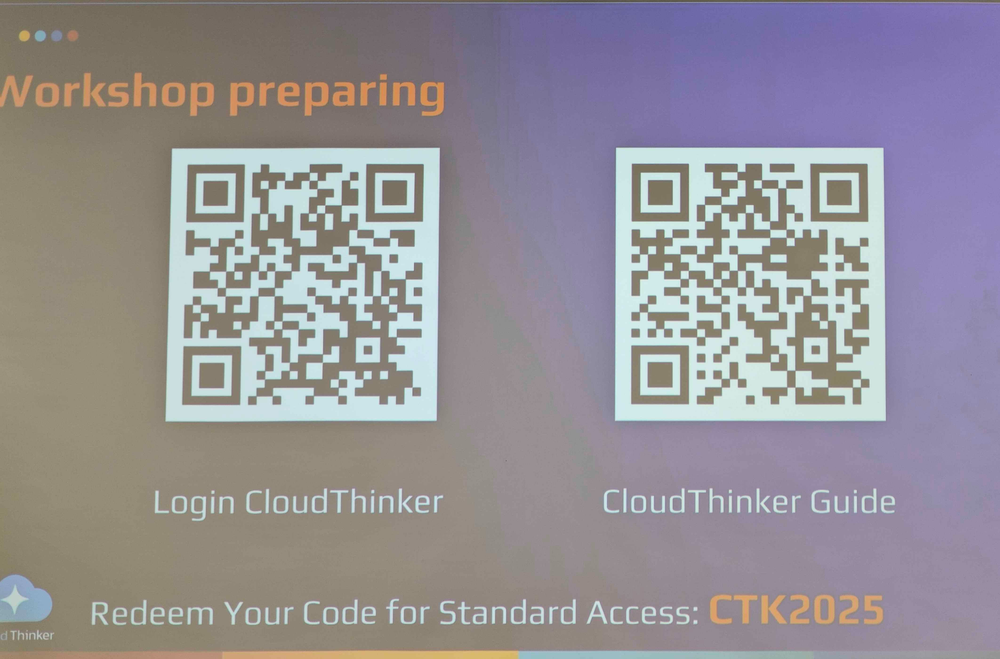
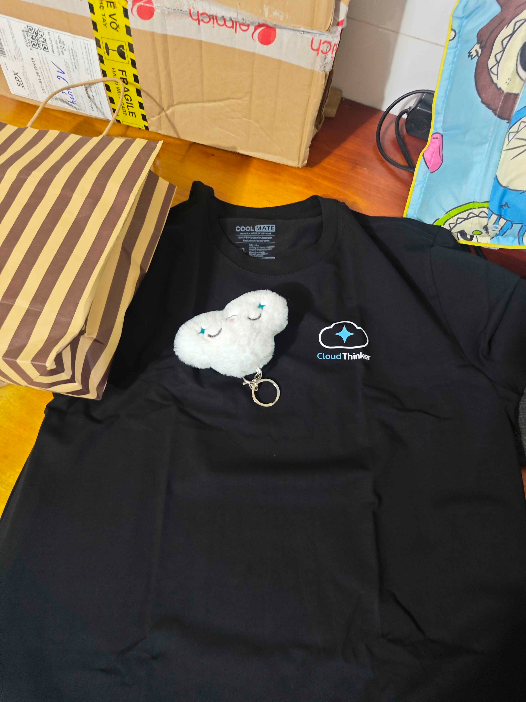

# Báo cáo tổng kết: Xây dựng Agentic AI & Tối ưu hóa ngữ cảnh với Amazon Bedrock

## Mục tiêu sự kiện
- Từ POC đến Production: Hướng dẫn trọn vẹn hành trình xây dựng AI, từ Proof‑of‑Concept đến agent sẵn sàng production với Bedrock AgentCore.
- Tự động hóa vận hành: Minh họa cách AI Agents tự động xử lý tối ưu chi phí, tăng cường bảo mật và quản trị tài nguyên trên môi trường đa đám mây.
- Kiến trúc ứng dụng: Kết nối lý thuyết kiến trúc cấp cao với triển khai thực tế các quy trình (workflows) có AI hỗ trợ.
- Hiệu quả vận hành: Cho thấy việc tích hợp Agentic AI giúp tinh gọn quy trình và giảm tải công việc thủ công cho kỹ sư.

## Diễn giả
- Nguyễn Gia Hưng – Head of Solutions Architect, AWS
- Kiên Nguyễn – Solutions Architect, AWS
- Việt Phạm – Founder & CEO, Diaflow
- Thắng Tôn – Co‑founder & COO
- Henry Bùi – Head of Engineering, CloudThinker
- Kha Văn – AWS Community Builder

## Các điểm nhấn chính (Session Highlights)
- Kiến trúc nền tảng: Phân tích kiến trúc nền tảng AI‑agent của CloudThinker dành cho vận hành đám mây hiện đại.
- Orchestration logic: Kết hợp Amazon Bedrock với “agentic orchestration” để xây dựng quy trình tự động, thông minh.
- Live use cases: Agents thực thi tối ưu chi phí, giám sát tài nguyên, kiểm toán bảo mật và tác vụ liên đám mây.
- CloudThinker Hack: Phần workshop thực hành để người tham dự tự tay xây dựng các tác vụ do agent điều phối.
- Networking: Phiên trao đổi/giao lưu buổi trưa để bàn luận ý tưởng với đội ngũ CloudThinker và cộng đồng.

## Bài học chính (Key Takeaways)
- Dịch chuyển vận hành: Agentic AI (được orchestration đúng cách) loại bỏ phần “boilerplate ops”, giúp đội ngũ tập trung vào thiết kế hệ thống giá trị cao.
- Tự động hóa dễ tiếp cận: Công cụ như CloudThinker giúp tối ưu đa đám mây mà không cần xây hệ thống nội bộ phức tạp từ đầu.
- Cách tiếp cận lai: Quản trị cloud hiệu quả (chi phí/hiệu năng/bảo mật) là sự kết hợp AI + tự động hóa + giám sát của con người.
- Thực tiễn hơn khẩu hiệu: Trải nghiệm hands‑on làm rõ trade‑offs, giới hạn và quyết định thiết kế khi hướng tới “tự động hóa mọi thứ”.

## Trải nghiệm sự kiện
Sự kiện giúp “giải ảo” Agentic AI bằng các câu chuyện end‑to‑end và demo cụ thể. Diễn giả cho thấy orchestration và dịch vụ cloud hội tụ để tạo vận hành an toàn, có thể mở rộng. Các màn trình diễn phân tích chi phí và cảnh báo bảo mật đã chuyển những tác vụ tốn giờ kỹ sư thành quy trình tự động, có thể kiểm toán.

## Thư viện ảnh sự kiện

